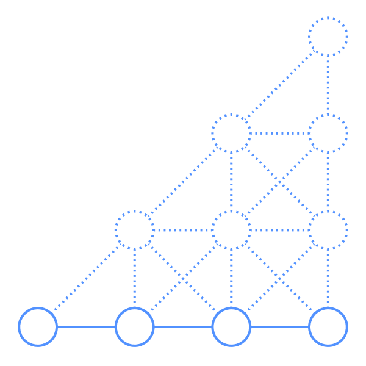

<!-- PROJECT SHIELDS -->
 

<!-- PROJECT LOGO -->
 

  

  <h1 align="center">Patsch</h1>

  <h5 align="center">
    Critical Patrolling Schedules for Two Robots on a Line
  </h5>

  

    About the project...
     
     
  

## Getting Started
To get started with the project you will need ***JDK 11***. The project has been packaged using ***Gradle***. To test, compile and assemble the project, run the following command:

`./gradlew build`

To only run the tests:

`./gradlew test`

To run our application that searches for all critical instances for a given integer m, where m > 1 (defaults to m=4 if args not specified), using t threads:

`./gradlew run --args="m t"`

To list all available gradle tasks:

`./gradlew tasks`

<!-- LICENSE -->
## License
Distributed under the GPL-3.0 License. See [LICENSE](LICENSE) for more information.

<!-- CONTACT -->
## Contact

- Iman Radjavi: radjavi@hotmail.com
- Anton Gustafsson: antong95@gmail.com